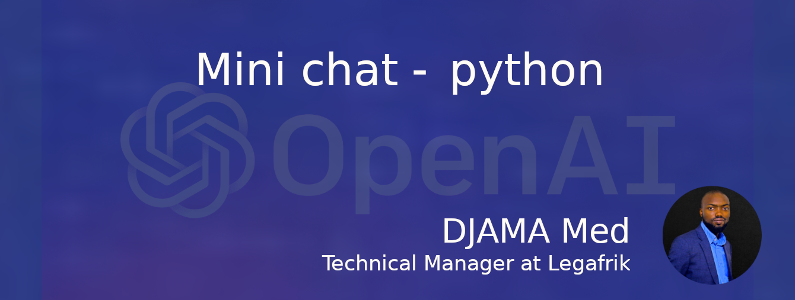

# ChatBot

## Installation & Setup

# Install Python
[For Mac] https://www.dataquest.io/blog/installing-python-on-mac/

[For Windows] https://www.digitalocean.com/community/tutorials/install-python-windows

[For Ubuntu] https://iohk.zendesk.com/hc/en-us/articles/16724475448473-Install-Python-3-11-on-ubuntu


# Install pip
[For Mac] https://phoenixnap.com/kb/install-pip-mac

[For Windows] https://www.geeksforgeeks.org/how-to-install-pip-on-windows/

[For Ubuntu] https://www.educative.io/answers/installing-pip3-in-ubuntu

If you have Python & pip installed then check their version in the terminal or command line tools

```
python3 --version
```

```
pip --version
```

## Installing Flask

In your terminal run the requirements.txt file using this pip

```
pip install -r requirements.txt
```


## Running ChatBot Application in Terminal

```
cd into your directory
```

```
. venv/bin/activate
```


```
python app.py
```


## What you will create

In this tutorial, I will guide you through the process of building a chatbot that can carry out conversations with users using natural language processing.

To start, we will be using Chat-gpt 3.5, a pre-trained language model that can generate human-like responses to given prompts. We will be integrating Chat-gpt 3.5 with Flask, a popular Python web framework, to create a web application that can communicate with users via a chat interface.

For the frontend of our application, we will be using HTML, CSS, and JavaScript to create a visually appealing and interactive chat interface. Additionally, we will be using jQuery to handle the HTTP requests that are made to the backend server.

Throughout the tutorial, I will provide step-by-step instructions on how to set up your development environment, install the necessary dependencies, and create the required files and code for the application. I will also explain how to train and fine-tune the Chat-gpt 3.5 model to improve the accuracy of its responses.

By the end of this tutorial, you will have a fully functional chatbot that can engage in conversations with users, and you will have gained valuable experience in using Chat-gpt 3.5, Flask, and web development technologies such as HTML, CSS, and JavaScript.


## Ce que vous allez créer

Dans ce tutoriel, je vais vous guider tout au long du processus de création d'un chatbot capable de mener des conversations avec les utilisateurs à l'aide du traitement du langage naturel.

Pour commencer, nous utiliserons Chat-gpt 3.5, un modèle de langage pré-entraîné qui peut générer des réponses de type humain aux invites données. Nous intégrerons Chat-gpt 3.5 à Flask, un framework Web Python populaire, pour créer une application Web capable de communiquer avec les utilisateurs via une interface de chat.

Pour l'interface de notre application, nous utiliserons HTML, CSS et JavaScript pour créer une interface de discussion visuellement attrayante et interactive. De plus, nous utiliserons jQuery pour gérer les requêtes HTTP adressées au serveur backend.

Tout au long du didacticiel, je fournirai des instructions étape par étape sur la façon de configurer votre environnement de développement, d'installer les dépendances nécessaires et de créer les fichiers et le code requis pour l'application. J'expliquerai également comment entraîner et affiner le modèle Chat-gpt 3.5 pour améliorer la précision de ses réponses.

À la fin de ce didacticiel, vous disposerez d'un chatbot entièrement fonctionnel capable d'engager des conversations avec les utilisateurs et vous aurez acquis une expérience précieuse dans l'utilisation de Chat-gpt 3.5, Flask et des technologies de développement Web telles que HTML, CSS et JavaScript. .

# Documentation API openai
Le Chatbot est construit à l'aide du modèle chat-gpt 3.5 d'openai.

```
https://platform.openai.com/docs/introduction
```

# User-Html

```
var userHtml = '<div class="d-flex justify-content-end mb-4"><div class="msg_cotainer_send">' + user_input + '<span class="msg_time_send">'+ time + 
    '</span></div><div class="img_cont_msg"></div></div>';
```

# Bot-HTML

```
var botHtml = '<div class="d-flex justify-content-start mb-4"><div class="img_cont_msg"></div><div class="msg_cotainer">' + bot_response + '<span class="msg_time">' + time + '</span></div></div>';
```